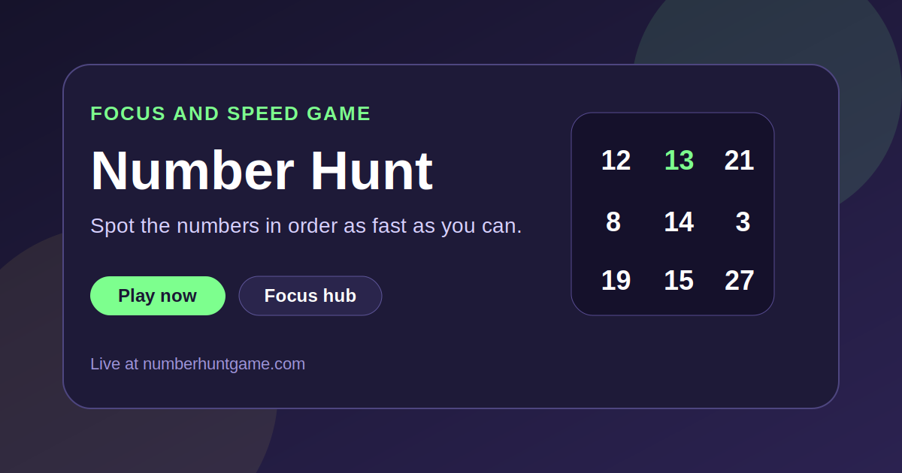

  

<h1 align="center">Number Hunt</h1>

  A fast browser game about visual scanning, focus, and speed, built to feel immediate on both desktop and mobile.

  <a href="https://numberhuntgame.com/"><strong>Play Now</strong></a>
  ·
  <a href="https://numberhuntgame.com/focus/"><strong>Focus Hub</strong></a>
  ·
  <a href="https://numberhuntgame.com/focus/find-numbers-game/"><strong>Find Numbers Guide</strong></a>

  

## What It Is

Number Hunt is a lightweight speed-and-attention game where the core loop is simple: spot numbers in sequence as fast as possible. The product leans on clean visuals, instant restarts, and short sessions that work well as quick mental sprints.

This public repository acts as a GitHub landing page for the live site and its supporting focus-related content.

## Live Sections

| Section | Link | Purpose |
| --- | --- | --- |
| Home | [numberhuntgame.com](https://numberhuntgame.com/) | Main game experience |
| Focus Hub | [numberhuntgame.com/focus/](https://numberhuntgame.com/focus/) | Content cluster around focus games and attention |
| Find Numbers Game | [numberhuntgame.com/focus/find-numbers-game/](https://numberhuntgame.com/focus/find-numbers-game/) | Intent page around the core gameplay idea |

## Why It Feels Different

- The game loop is visible immediately and needs no setup.
- The mechanic is simple enough for quick sessions but still competitive.
- The site combines playable product UI with SEO pages around focus and visual attention.
- The visual language stays bold and game-like instead of looking like a generic article site.

## Project Snapshot

- Topic: visual attention, focus, and speed games
- Stack: HTML, CSS, vanilla JavaScript
- Modes: core number hunt gameplay plus supporting content pages
- UX goal: instant play and quick repeat sessions
- SEO goal: build a focused content cluster around search intent near the game

## More Projects

| Project | Live site | Public repo |
| --- | --- | --- |
| SkillSudoku | [skillsudoku.com](https://skillsudoku.com/) | [skillsudoku_public](https://github.com/ivanlukichev/skillsudoku_public) |
| CalcSprint | [calcsprint.com](https://calcsprint.com/) | [CalcSprint](https://github.com/ivanlukichev/CalcSprint) |
| PlayMathPuzzles | [playmathpuzzles.com](https://playmathpuzzles.com/) | [PlayMathPuzzles](https://github.com/ivanlukichev/PlayMathPuzzles) |
| Sudoku Play | [sudoku-play.org](https://sudoku-play.org/) | [Sudoku-Play](https://github.com/ivanlukichev/Sudoku-Play) |

## Visit

  <a href="https://numberhuntgame.com/"><strong>Open Number Hunt</strong></a> 
  <a href="https://numberhuntgame.com/focus/">Browse the Focus Hub</a> 
  <a href="https://numberhuntgame.com/focus/find-numbers-game/">Read the Find Numbers page</a>

